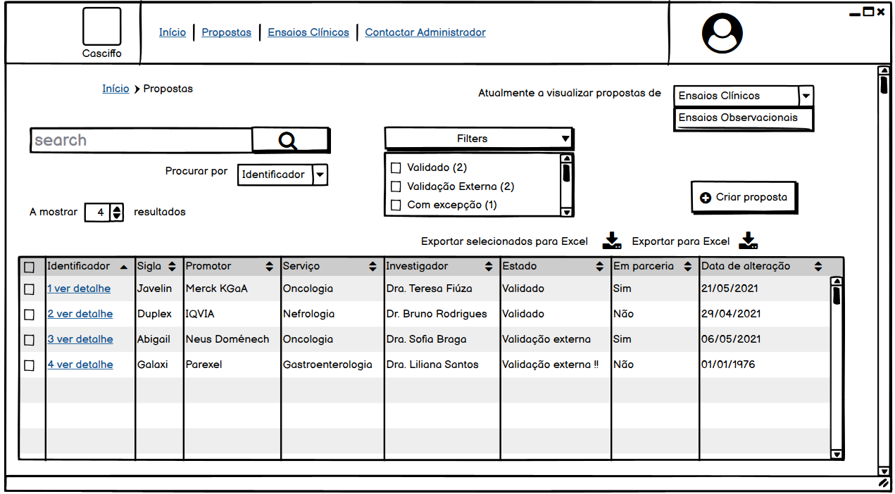
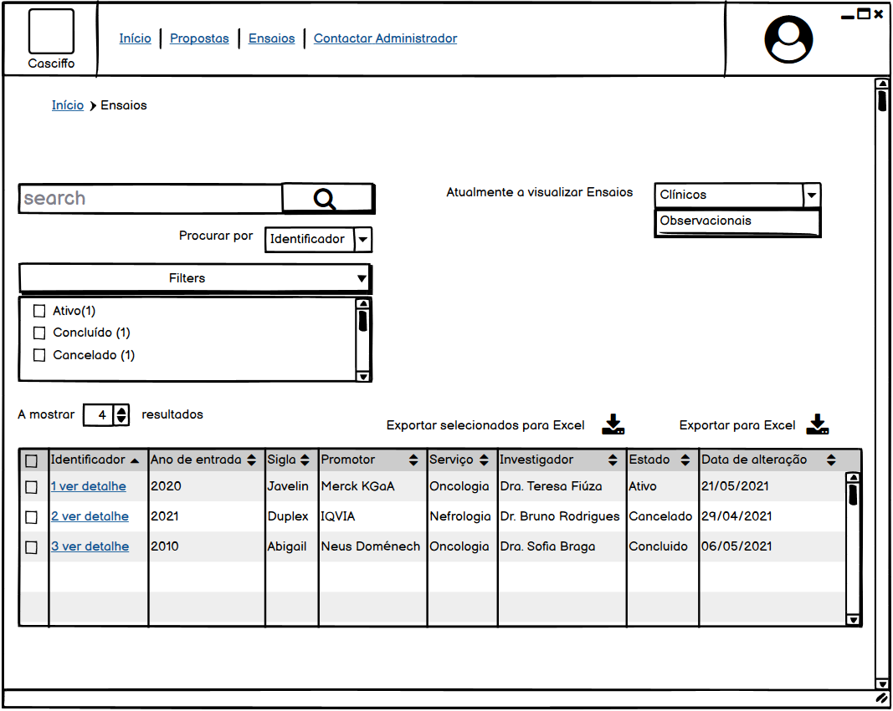
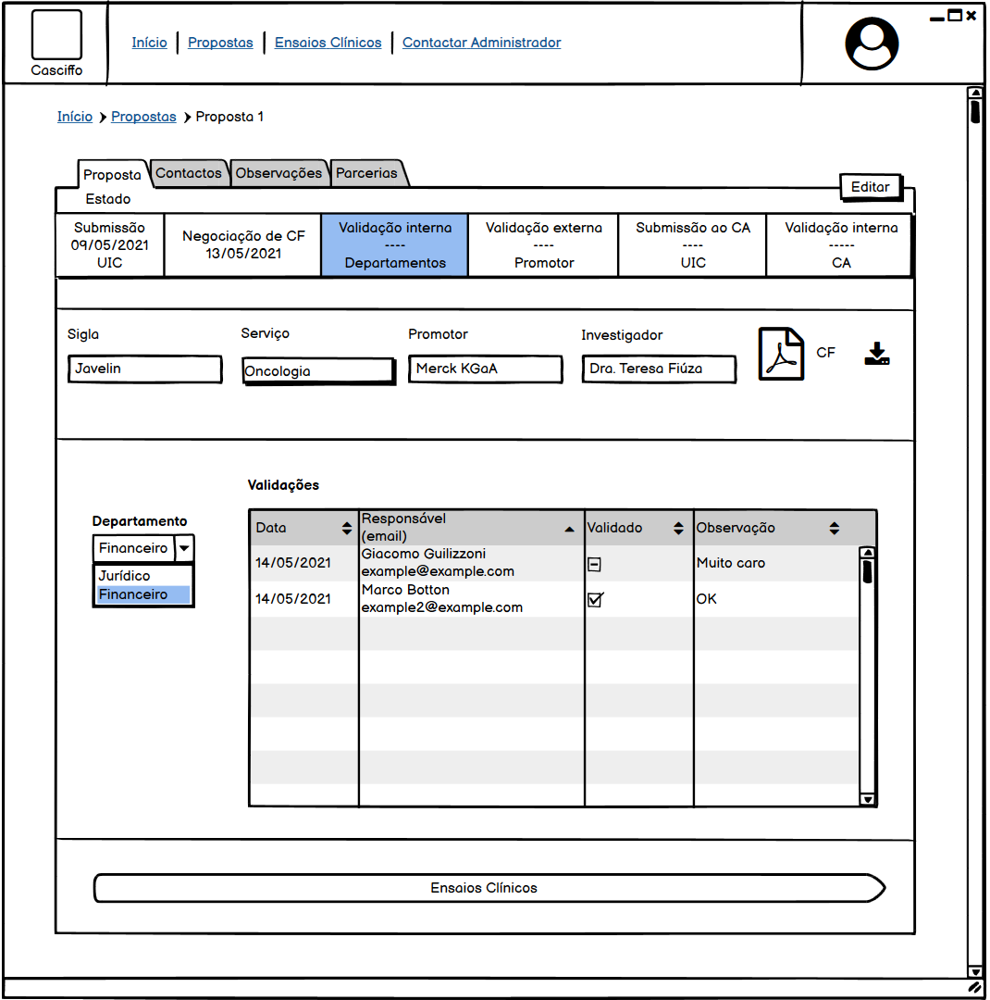

# Chapter 3
This chapter consists of a detailed view over the inner workings and functional requirements of the platform CASCIFFO.
It is structured with the following sections:
- Access control: Identification and categorization of actors and their roles.
- Processes: Identification and detailing of the flow of processes.
- Functional Requirements: Description of functional requirements.

## 1 Access control
Given the nature of the platform CASCIFFO, where many actors are at play, there needs to be a well-defined structure of access control. Each involved actor must have a role and a set of permissions. The actors involved within the application are the UIC, Administrative Council ("Concelho Administrativo", CA), the Financial and Juridical department, UIC Support Office ("Gabinete de apoio à UIC", GAUIC) and finally a Superuser. These actors have been categorized, in the format Role={Actor}, as follows:  
- UIC={UIC, GAUIC} ⇒ baseline of permissions, each user belonging to this role can view any Clinical Investigation, create, edit and cancel their own Clinical Investigations.
- Finance={Financial department} ⇒ Can validate Clinical Trials financial component.
- Juridical={Juridical department} ⇒ Can validate Clinical Trials juridical component.
- Management={CA} ⇒ Can validate/cancel pending Clinical Investigation proposals.
- Superuser={} ⇒ Has absolute control over the application.

## 2 Processes
This section details the types of processes occurring within the scope of the project.  
There are three identified processes, which consists of the lifecycle of a Clinical Investigation proposal, its validation and the Clinical Trials lifecycle.

### 2.1 Clinical Investigation proposals
From the moment a Clinical Investigation is proposed, it follows through a series of states and protocols that must be adhered to in order for it to be completely validated.
There are two types of Clinical Investigations: Clinical Trials and Observational Trials.  
Each state has an entity responsible, `owner`, for advancing the state. 
The flow of states is as follows:  
1) `Submetido`, `owner=UIC`
2) `Negociação de CF`, `owner=UIC`
3) `Validação interna`, `owner=Finance,Juridical`
4) `Validação externa`, `owner=UIC`
5) `Submissão ao CA`, `owner=UIC`
6) `Validação interna`, `owner=Management`

The enumerated set of states corresponds to the lifecycle of a Clinical Trial Proposal. An Observational Trial Proposal consists of the enumerated states {1,4,5,6}; it lacks a financial component and a promoter.  

Taking the example of the submission of a Clinical Trial Proposal, once it's submitted, the (CA via app and email?) will be notified. The proposal is currently in the state `Submetido`.  
When the negotiation of the financial contract begins, the principal Investigator (which has the role of UIC), will advance the state to its next step in the proposal's evolution, `Negociação de CF`.  
When the financial negotiation reaches an agreement of the UIC and external promotor, the investigator advances the state to its next stage, `Validação Interna`. Upon advancing, the users with the Role of `Finance` and `Juridical`, which represents the Financial and Juridical internal departments, respectfully, will be notified that a proposal is ready to be evaluated. The evaluation will consist of a simple `Accept` or `Refuse` with added justification for the choice. In case either the user with `Finance` or `Juridical` role reject the financial contract, the proposal's will backtrack to `Negociação de CF`, notifying the UIC of the occurrence.  
When it's accepted by both roles, the proposal will automatically advance into the next state, `Validação Externa`. In this state the UIC verifies all the documents and final version of the financial contract, and sends them, via the platform CASCIFFO, to the external promotor, requesting their signatures. When the reply is received via email, the UIC adds the received signatures and possible additional documents to the proposal in the CASCIFFO platform, advancing it to the next stage `Submissão ao CA`.  
há aqui uma noance no fluxo "GAUIC" recebe a pasta do EC, via externa ou interna? Assumo que é interno visto que a documentação já existe na platforma. intervenção de GABUIC no fluxo é questionável.
The state `Submissão ao CA` will notify the principal investigator both via the platform and email that a proposal requires their signature. Once the principal investigator submits their signature into the platform, UIC(investigator? another person within the UIC?) will verify the documents and (carta EC?) advance the state into `Validação interna`, where the `CA` role will receive a notification stating that a proposal is ready for its final evaluation.  
Once a user with the role of `CA` checks the proposal it can validate or invalidate the proposal. In case it's invalidated, the proposal will become `cancelled` with its lifecycle ending there, however, if it is validated, the proposal can become fully validated once the termination of another process is completed successfully.  
This process, which can be considered a sub-process, called the [validation] protocol, starts in a parallel manner when the proposal is first submitted.  
The purpose of this protocol is to validate the Clinical Investigation's ethical and safety values.  
When a proposal is submitted, this protocol begins in a manner that is parallel to the mentioned flow of states.  The proposal is sent to external agencies for review and approval, including the [Clinical Investigations Ethics Comity ("Comissão de Ética para Investigação Clínica", CEIC)](https://www.ceic.pt/) followed by [INFARMED, I.P](https://www.infarmed.pt/web/infarmed) and the General Regulation of Data Protection ("Regulação Geral de Proteção de Dados", RGPD).  
When a proposal has passed through the described validation protocol and has been fully validated within the HFF/UIC internal departments, a Clinical or Observational Trial is automatically created, importing the core information of the proposal into itself. If either process declares the proposal invalid, its state becomes `cancelled`, notifying the UIC and showing the root cause of cancelation.

Each proposal is distinguished by five main properties, the principal investigator, the type of investigation, the type of therapeutic service it's integrated into (i.e Oncology), the `Sigla` which represents the name of the therapeutic or medicine and the partnerships involved in the investigation.  
Proposals with a financial component must also include the promoter of the investigation, in addition to the properties listed.  

### 2.2 Clinical Trials
The lifecycle of a Clinical Trial is divided into three stages: active, completed, and canceled.  
During the active stage, the principal investigator of the Clinical Trial will monitor, schedule appointments and manage the patients involved in the study.  
As mentioned previously, a Clinical Trial has a financial component, the principal investigator can easily access and check.

## 3 Functional Requirements
This section details the functional requirements and presents a mock user interface (UI) that will satisfy the requirement.
The main features of CASCIFFO can be separated into 3 groups, which are: general functionalities, clinical component and financial component.  
1) General features  
   - Visualization and management of Clinical Trials as a process; 
   - Ability to edit and validate data (edit checks); 
   - Creation and management of online queries (in-form query); 
   - Access control based on different user profiles; 
   - Access by computer, tablet or smartphone; 
   - Ability to export information in numerical or graphical mode; 
   - Ability to customize the form of visualization.
2) Clinical Component
   - View detailed characteristics and evolution of clinical Trials including the tested medicine or technique in question;
   - Monitoring the set of patients included in clinical Trials and their characteristics;
   - Insertion of patient data in face-to-face or teleconsultation;
   - Inclusion of Supplementary Diagnostic Therapy (MCDT) associated with (ECG, RX, etc.);
   - Characteristics of the treatment associated with the clinical trial and monitoring of the patient’s behavior under trial and its attendance;
   - Pharmacy monitoring (Reception, dispensing, return, stock);
   - Monitoring of visits;
   - Recording of adverse events associated with patients due to the trial drug.  

### 3.1 Visualization and management of Clinical Trials as a process
To view and manage a Clinical Trial as a process, a user needs only to view the general overview of Clinical Trials or Clinical Investigations Proposals.
As shown in fig.1 and fig.2, the user has an overview of the all submitted proposals and clinical trials with their main characteristics, such as, the identification, current state, last alteration date, the principal investigator and whether it has partnerships or not.

When a user clicks in view details ("ver detalhe"), he will be redirected to a screen displaying the details of the chosen Clinical investigation.

### 3.2 View detailed Characteristics and evolution of clinical Trials including the tested medicine or technique in question

To view detailed information about a Clinical Investigation, one needs to first overview the Clinical Investigations and click on the details of a desired Clinical Investigation.
The evolution of any Clinical Investigation consists of its proposal followed the trial activity once the proposal has been fully validated.
In fig.3, the details of a Clinical Trial proposal can be viewed. The flow of state of a proposal is shown in the form of a bar in a straight forward manner. Each state corresponds to a division, box, in the bar and has three properties: the name of the State, the date it was completed (if it hasn't been completed it will be shown as "------") and finally the entity responsible for advancing the state.  
It is possible to click in the box of a state to display information about the events that occurred during the time the proposal was in that state. 

A Clinical Trial proposal also another four components alongside its principal details displayed as tabs: the Contacts ("Contactos") which corresponds to comments related to external communications; the Observations ("Observações") which contains comments made in regard to the proposal; the Partnerships ("Parcerias"), where one can find the partnerships involved in the study proposal; and finally the validation Protocol ("Protocolo"), where it can be viewed the current state of affairs of the process described in section 2.1. In all four components, the state of the proposal will also be shown.

